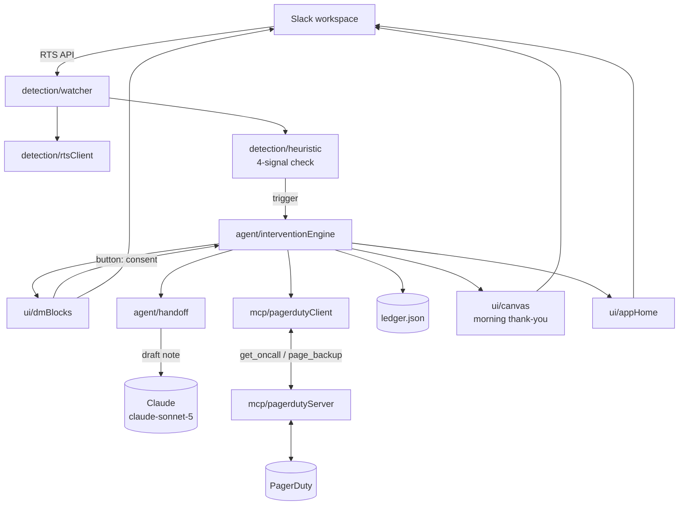

# Quiet Hours

**An on-call agent that protects the human, not just the service.**

Quiet Hours watches high-intensity Slack channels and steps in when it sees one person carrying an incident alone, late at night — offering a warm, honest intervention, drafting a handoff, and paging a rested backup so nobody burns out solo.

---

## The problem

On-call and volunteer burnout is a well-documented pattern in SRE and developer-survey literature: the person who happens to catch a 2 a.m. incident often ends up carrying it alone for hours, past the point where they're making good decisions, because there's no natural moment where anyone says "let me take this — go sleep." Tooling watches the *service* (latency, error rates, SLOs). Almost nothing watches the *human*.

Quiet Hours fills that gap. It doesn't diagnose, doesn't nag, and never invents a metric to make its case. It observes what's actually happening in the channel, and when the pattern is unambiguous, it offers help the person can accept or decline.

## How it works

Quiet Hours runs a transparent **4-signal heuristic** over channel activity. It triggers only when *all four* hold:

1. **Single carrier** — one person has sent ≥ 30 messages in the incident window.
2. **No relief** — no other human has replied for ≥ 60 minutes.
3. **Late or long** — the carrier's local time is ≥ 23:00, **or** they've been solo for ≥ 3 hours.
4. **Consent on file** — the user has opted in to Quiet Hours.

When it triggers, the intervention flow is:

1. **DM the human** — a warm, honest message stating the *observed facts* (message count, hours solo, local time) with action buttons.
2. **On consent** — Claude drafts a handoff note from the channel context; Quiet Hours pages a **rested backup** from the on-call schedule via a PagerDuty MCP server.
3. **Hold the noise** — non-critical pings are held/silenced so the handoff is clean.
4. **Morning thank-you** — a Canvas built **only from observed data** thanks the human for the night and records what happened.

At every step the human keeps agency: **keep-going** and **snooze** are always one click away. Quiet Hours never diagnoses and never overrides.

## The three required technologies — and exactly where each is used

| Technology | Where it's used |
|---|---|
| **Slack Real-Time Search (RTS) API** | Detection. `src/detection/rtsClient.js` + `watcher.js` pull real-time channel context (who's speaking, how often, when others last replied) that feeds the heuristic in `heuristic.js`. |
| **MCP server integration** | Handoff. `src/mcp/pagerdutyServer.js` exposes `get_oncall` and `page_backup` tools; `pagerdutyClient.js` calls them to find and page a rested backup from the PagerDuty schedule. |
| **Slack AI** | The Assistant surface (App Home / DM assistant), the **Claude-drafted handoff note** (`src/agent/handoff.js`), and the morning **Canvas** (`src/ui/canvas.js`). |

All three are load-bearing: remove RTS and there's no detection; remove MCP and there's no rested backup to page; remove Slack AI and there's no handoff draft or Canvas. See [docs/ARCHITECTURE.md](docs/ARCHITECTURE.md) for why.

## Architecture



## Project structure

```
src/
  app.js                     Bolt wiring (Socket Mode)
  config.js                  env + watched-channel config
  detection/
    watcher.js               subscribes to channels, orchestrates detection
    heuristic.js             the transparent 4-signal check
    rtsClient.js             Slack Real-Time Search API client
  ledger/
    ledger.js                JSON-file IncidentSession store
  ui/
    dmBlocks.js              intervention DM (facts + buttons)
    canvas.js                morning thank-you Canvas
    appHome.js               App Home / opt-in surface
    copy.js                  warm, honest copy strings
  mcp/
    pagerdutyServer.js       MCP server: get_oncall, page_backup
    pagerdutyClient.js       MCP client used by the engine
  agent/
    handoff.js               Claude-drafted handoff note
    interventionEngine.js    the intervention state machine
  demo/
    seed.js                  seeds a fake incident for the demo
    incident-script.json     scripted messages for `/quiethours demo`
```

## Quick start

Prerequisites: **Node ≥ 20**.

```bash
npm install
cp .env.example .env          # then fill in tokens (see docs/SETUP.md)
```

1. Create the Slack app from `manifest.json` (scopes, Socket Mode, slash command — see [docs/SETUP.md](docs/SETUP.md)).
2. Fill `.env` with your Slack tokens. Anthropic and PagerDuty keys are **optional** — mock fallbacks let you run the full flow without them.
3. Start it:

```bash
npm start
```

4. Try the demo — in any channel the bot is in:

```
/quiethours demo
```

This seeds a scripted late-night incident and walks the whole flow end to end: detection → DM → handoff → page → morning Canvas.

## The honesty principle

Every number Quiet Hours shows a human is **observed**, never estimated, inferred, or invented. The DM says "42 messages, 3 hours solo, 01:12 your time" because those are counts from the channel — not a wellness score, not a "burnout risk," not a diagnosis. The morning Canvas is assembled *only* from ledger facts recorded during the incident. If Quiet Hours can't observe it, it doesn't say it. This is what keeps the agent honest and non-paternalistic: it presents reality and lets the human decide.

## Judges: how to evaluate in 3 minutes

> 1. **See detection (RTS):** run `/quiethours demo`. The heuristic fires on scripted RTS context; watch the trigger log name all four signals.
> 2. **See the intervention (Slack AI):** the DM arrives with observed facts and buttons. Click **Get me a backup**.
> 3. **See the handoff (MCP):** `get_oncall` finds a rested backup, Claude drafts the handoff note, `page_backup` pages them — all via the PagerDuty MCP server.
> 4. **See the payoff (Slack AI):** the morning Canvas is posted, built only from observed data.
>
> All three required technologies — **RTS, MCP, Slack AI** — appear on screen in that one run.

---

*Slack Agent Builder Challenge · Track: Agent for Good · Built to protect the human, not just the service.*
