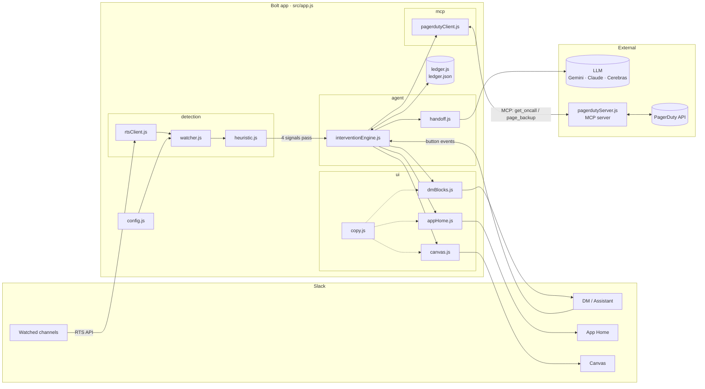
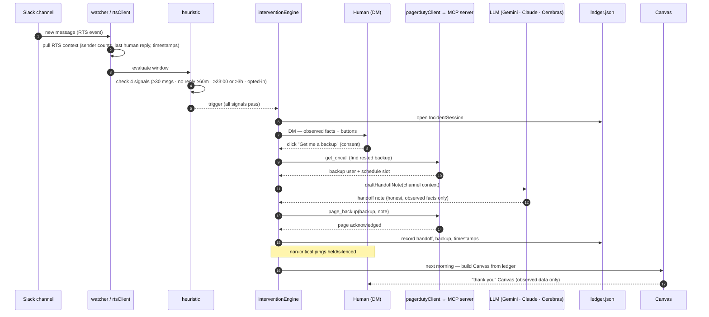

# Architecture

Quiet Hours is a Bolt for JavaScript app (Socket Mode) that observes Slack channel activity, decides via a transparent heuristic whether one human is carrying an incident alone late at night, and — with that human's consent — hands the incident off to a rested backup. It leans on three technologies that each do real work: **Slack RTS** for detection, an **MCP server** for the PagerDuty handoff, and **Slack AI** for the assistant surface, the AI-drafted handoff note (provider chain: Anthropic → Gemini → Cerebras, with a templated fallback), and the morning Canvas.

## Component diagram

## Sequence: the full flow

## Data model

The single persisted entity is the **IncidentSession**, stored in the JSON-file ledger (`src/ledger/ledger.js`). It captures only observed facts so the morning Canvas can be reconstructed truthfully.

| Field | Type | Meaning |
|---|---|---|
| `id` | string | Session id (channel + window). |
| `channelId` | string | Watched channel where the incident was detected. |
| `carrierUserId` | string | The human carrying the incident. |
| `startedAt` | ISO timestamp | First message in the detected window. |
| `messageCount` | number | Messages the carrier sent in the window (observed). |
| `lastOtherHumanReplyAt` | ISO timestamp \| null | When any other human last replied. |
| `carrierLocalHour` | number | Carrier's local hour at trigger (from `QH_TIMEZONE_OFFSET_HOURS`). |
| `soloDurationMins` | number | Minutes solo (observed). |
| `signals` | object | The 4 boolean signal results at trigger (for transparency). |
| `state` | enum | `detected` → `dm_sent` → `consented` \| `snoozed` \| `keep_going` → `handed_off` → `closed`. |
| `consentAt` | ISO timestamp \| null | When the human consented. |
| `backupUserId` | string \| null | Rested backup returned by `get_oncall`. |
| `handoffNote` | string \| null | AI-drafted note actually sent (LLM: Gemini · Claude · Cerebras, or templated fallback). |
| `pagedAt` | ISO timestamp \| null | When `page_backup` was acknowledged. |
| `canvasPostedAt` | ISO timestamp \| null | When the morning Canvas went out. |

Everything the Canvas prints is drawn from these fields — no derived "scores," no inferred state.

## Why RTS and MCP are load-bearing (not decorative)

**Slack RTS is the sensory system.** The entire premise — "one person is carrying this alone right now" — is a *real-time, cross-message* judgment. It cannot be made from a single event payload; it needs to know who else has spoken, how recently, and how the message rate is trending across the window. RTS is what supplies that context to the heuristic. Swap it out and there is no detection at all — the agent goes blind.

**The MCP server is the actuator.** Detecting the problem is worthless if the fix is "post a message and hope someone volunteers." The value is in *actually paging a rested human*, which requires reading a live on-call schedule and issuing a page. `pagerdutyServer.js` exposes exactly two tools — `get_oncall` (who is rested and available) and `page_backup` (page them with the handoff note) — and the intervention engine calls them through a standard MCP client. Remove the MCP integration and the agent can notice the problem but can't resolve it; the handoff becomes a suggestion instead of an action.

Together they close the loop: RTS turns raw channel traffic into an honest observation, and the MCP server turns the human's consent into a real, rested backup on the pager. Slack AI carries the human-facing half — the assistant conversation, the AI-drafted handoff (provider chain: Anthropic → Gemini → Cerebras, with a templated fallback), and the morning Canvas — so the whole exchange stays warm and legible rather than mechanical.
